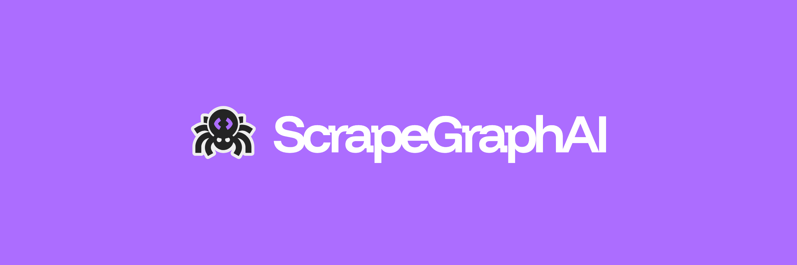

# ScrapeGraphAI JS SDK

[](https://badge.fury.io/js/scrapegraph-js)
[](https://opensource.org/licenses/MIT)

<p align="center">
  <a href="https://scrapegraphai.com">
    
  </a>
</p>

Official TypeScript SDK for the [ScrapeGraphAI AI API](https://scrapegraphai.com).

## Install

```bash
npm i scrapegraph-js
# or
bun add scrapegraph-js
```

## Quick Start

### API key

Log in to the [ScrapeGraphAI dashboard](https://scrapegraphai.com/) to create an API key. The dashboard also shows your request history, usage, credits, and crawl/monitor activity.

Set it in your environment:

```bash
export SGAI_API_KEY=...
```

```ts
import { ScrapeGraphAI } from "scrapegraph-js";

// reads SGAI_API_KEY from env, or pass explicitly: ScrapeGraphAI({ apiKey: "..." })
const sgai = ScrapeGraphAI();

const result = await sgai.scrape({
  url: "https://example.com",
  formats: [{ type: "markdown" }],
});

if (result.status === "success") {
  console.log(result.data?.results.markdown?.data);
} else {
  console.error(result.error);
}
```

Every function returns `ApiResult<T>` — no exceptions to catch:

```ts
type ApiResult<T> = {
  status: "success" | "error";
  data: T | null;
  error?: string;
  elapsedMs: number;
};
```

## 🆚 Open Source vs Managed API

This SDK is a client for the **managed cloud API**. ScrapeGraphAI also ships an [open-source library](https://github.com/ScrapeGraphAI/Scrapegraph-ai) you can run yourself. This table explains the difference so you can pick the right one.

| | Open Source (`scrapegraphai`) | Managed API (this SDK) |
|---|---|---|
| **What it is** | A Python library you run yourself | A hosted cloud service you call via SDK |
| **Where it runs** | Your own infrastructure (self-hosted) | ScrapeGraphAI cloud |
| **LLM** | Bring your own (OpenAI, Groq, Gemini, Azure, local via Ollama) | Managed for you |
| **Browser / JS rendering** | You configure it (Playwright) | Managed (stealth, `auto`/`fast`/`js` modes) |
| **Proxies & anti-bot** | Your responsibility | Included |
| **Scaling & maintenance** | Your responsibility | Fully managed |
| **Cost model** | LLM tokens + your own infra | Pay-as-you-go credits |
| **Auth** | Your own LLM keys | `SGAI_API_KEY` |
| **Capabilities** | Graph pipelines (SmartScraper, Search, Speech, ScriptCreator…) | Scrape, Extract, Search, Crawl, Monitor, History |
| **Setup effort** | More configuration | Minimal — API key + one call |
| **License** | MIT | SDK is MIT; the API service is paid |

**Choose the open-source library** if you want full control, on-prem/self-hosted data, local LLMs (Ollama), or fine-grained cost tuning — and you're happy to manage browsers, proxies and scaling yourself.

**Choose the managed API** (this SDK) if you want zero infrastructure, managed JS rendering & anti-bot, built-in **Crawl** and scheduled **Monitor** jobs, and the fastest path to production — billed per credit.

- Open-source library: https://github.com/ScrapeGraphAI/Scrapegraph-ai
- Python SDK: https://github.com/ScrapeGraphAI/scrapegraph-py
- JS/TS SDK: https://github.com/ScrapeGraphAI/scrapegraph-js
- API docs: https://docs.scrapegraphai.com/introduction


## API

### scrape

Scrape a webpage in multiple formats (markdown, html, screenshot, json, etc).

```ts
const res = await sgai.scrape({
  url: "https://example.com",
  formats: [
    { type: "markdown", mode: "reader" },
    { type: "screenshot", fullPage: true, width: 1440, height: 900 },
    { type: "json", prompt: "Extract product info" },
  ],
  contentType: "text/html",        // optional, auto-detected
  fetchConfig: {                   // optional
    mode: "js",                    // "auto" | "fast" | "js"
    stealth: true,
    timeout: 30000,
    wait: 2000,
    scrolls: 3,
    headers: { "Accept-Language": "en" },
    cookies: { session: "abc" },
    country: "us",
  },
});
```

**Formats:**
- `markdown` — Clean markdown (modes: `normal`, `reader`, `prune`)
- `html` — Raw HTML (modes: `normal`, `reader`, `prune`)
- `links` — All links on the page
- `images` — All image URLs
- `summary` — AI-generated summary
- `json` — Structured extraction with prompt/schema
- `branding` — Brand colors, typography, logos
- `screenshot` — Page screenshot (fullPage, width, height, quality)

### extract

Extract structured data from a URL, HTML, or markdown using AI.

```ts
const res = await sgai.extract({
  url: "https://example.com",
  prompt: "Extract product names and prices",
  schema: { /* JSON schema */ },   // optional
  mode: "reader",                  // optional
  fetchConfig: { /* ... */ },      // optional
});
// Or pass html/markdown directly instead of url
```

### search

Search the web and optionally extract structured data.

```ts
const res = await sgai.search({
  query: "best programming languages 2024",
  numResults: 5,                   // 1-20, default 3
  format: "markdown",              // "markdown" | "html"
  prompt: "Extract key points",    // optional, for AI extraction
  schema: { /* ... */ },           // optional
  timeRange: "past_week",          // optional
  locationGeoCode: "us",           // optional
  fetchConfig: { /* ... */ },      // optional
});
```

### crawl

Crawl a website and its linked pages.

```ts
// Start a crawl
const start = await sgai.crawl.start({
  url: "https://example.com",
  formats: [{ type: "markdown" }],
  maxPages: 50,
  maxDepth: 2,
  maxLinksPerPage: 10,
  includePatterns: ["/blog/*"],
  excludePatterns: ["/admin/*"],
  fetchConfig: { /* ... */ },
});

// Check status
const status = await sgai.crawl.get(start.data?.id!);

// Fetch paginated pages with resolved scrape results
const pages = await sgai.crawl.pages(start.data?.id!, {
  cursor: 0,
  limit: 50,
});

// Control
await sgai.crawl.stop(id);
await sgai.crawl.resume(id);
await sgai.crawl.delete(id);
```

### monitor

Monitor a webpage for changes on a schedule.

```ts
// Create a monitor
const mon = await sgai.monitor.create({
  url: "https://example.com",
  name: "Price Monitor",
  interval: "0 * * * *",           // cron expression
  formats: [{ type: "markdown" }],
  webhookUrl: "https://...",       // optional
  fetchConfig: { /* ... */ },
});

// Manage monitors
await sgai.monitor.list();
await sgai.monitor.get(cronId);
await sgai.monitor.update(cronId, { interval: "0 */6 * * *" });
await sgai.monitor.pause(cronId);
await sgai.monitor.resume(cronId);
await sgai.monitor.delete(cronId);
```

### history

Fetch request history.

```ts
const list = await sgai.history.list({
  service: "scrape",               // optional filter
  page: 1,
  limit: 20,
});

const entry = await sgai.history.get("request-id");
```

### credits / healthy

```ts
const credits = await sgai.credits();
// { remaining: 1000, used: 500, plan: "pro", jobs: { crawl: {...}, monitor: {...} } }

const health = await sgai.healthy();
// { status: "ok", uptime: 12345 }
```

## Examples

| Service | Example | Description |
|---------|---------|-------------|
| scrape | [`scrape_basic.ts`](examples/scrape/scrape_basic.ts) | Basic markdown scraping |
| scrape | [`scrape_multi_format.ts`](examples/scrape/scrape_multi_format.ts) | Multiple formats (markdown, links, images, screenshot, summary) |
| scrape | [`scrape_json_extraction.ts`](examples/scrape/scrape_json_extraction.ts) | Structured JSON extraction with schema |
| scrape | [`scrape_pdf.ts`](examples/scrape/scrape_pdf.ts) | PDF document parsing with OCR metadata |
| scrape | [`scrape_with_fetchconfig.ts`](examples/scrape/scrape_with_fetchconfig.ts) | JS rendering, stealth mode, scrolling |
| extract | [`extract_basic.ts`](examples/extract/extract_basic.ts) | AI data extraction from URL |
| extract | [`extract_with_schema.ts`](examples/extract/extract_with_schema.ts) | Extraction with JSON schema |
| search | [`search_basic.ts`](examples/search/search_basic.ts) | Web search with results |
| search | [`search_with_extraction.ts`](examples/search/search_with_extraction.ts) | Search + AI extraction |
| crawl | [`crawl_basic.ts`](examples/crawl/crawl_basic.ts) | Start and monitor a crawl |
| crawl | [`crawl_with_formats.ts`](examples/crawl/crawl_with_formats.ts) | Crawl with screenshots and patterns |
| monitor | [`monitor_basic.ts`](examples/monitor/monitor_basic.ts) | Create a page monitor |
| monitor | [`monitor_with_webhook.ts`](examples/monitor/monitor_with_webhook.ts) | Monitor with webhook notifications |
| utilities | [`credits.ts`](examples/utilities/credits.ts) | Check account credits and limits |
| utilities | [`health.ts`](examples/utilities/health.ts) | API health check |
| utilities | [`history.ts`](examples/utilities/history.ts) | Request history |

## Environment Variables

| Variable | Description | Default |
|----------|-------------|---------|
| `SGAI_API_KEY` | Your ScrapeGraphAI API key | — |
| `SGAI_API_URL` | Override API base URL | `https://v2-api.scrapegraphai.com/api` |
| `SGAI_DEBUG` | Enable debug logging (`"1"`) | off |
| `SGAI_TIMEOUT` | Request timeout in seconds | `120` |

## Development

```bash
bun install
bun run test              # unit tests
bun run test:integration  # live API tests (requires SGAI_API_KEY)
bun run build             # tsup → dist/
bun run check             # tsc --noEmit + biome
```

## License

MIT - [ScrapeGraphAI AI](https://scrapegraphai.com)
